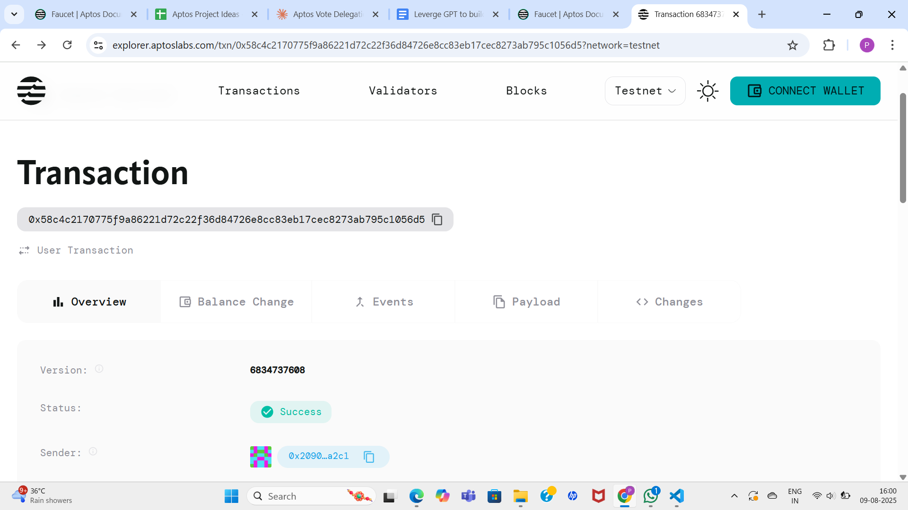

# Delegation System

## Project Description

The Delegation System is a smart contract built on the Aptos blockchain that enables users to delegate their voting power to other addresses while maintaining the ability to revoke that delegation at any time. This system provides a flexible and transparent way for users to participate in governance mechanisms by either exercising their voting rights directly or entrusting them to representatives they trust.

## Project Vision

Our vision is to create a decentralized governance framework that empowers users with maximum flexibility in their participation. By allowing seamless delegation and revocation of voting rights, we aim to:

- Increase participation in decentralized governance
- Enable expertise-based representation where users can delegate to knowledgeable community members
- Maintain democratic principles through revocable delegation
- Build trust through transparent and auditable delegation mechanisms

## Key Features

### 🗳️ **Vote Delegation**
- Users can delegate their voting power to any address on the network
- Delegation transfers the delegator's voting power to the chosen delegate
- Simple and secure delegation process with clear ownership transfer

### 🔄 **Revocation Capabilities**
- Complete control over delegation with instant revocation ability
- Delegators can reclaim their voting power at any time
- No lock-up periods or waiting times for revocation

### ⚡ **Lightweight Implementation**
- Minimal resource usage with efficient struct design
- Gas-optimized functions for cost-effective operations
- Clean and readable code structure for easy auditing

### 🔒 **Secure Architecture**
- Built on Aptos Move language for enhanced security
- Resource-based model prevents common smart contract vulnerabilities
- Clear separation of concerns between delegation and voting power management

### 📊 **Transparent Tracking**
- All delegations are recorded on-chain for full transparency
- Easy verification of current delegation status
- Immutable history of delegation changes

## Future Scope

### 🌐 **Enhanced Governance Integration**
- Integration with various DAO governance systems
- Support for multiple concurrent delegations for different proposals
- Time-locked delegations with automatic expiry

### 📈 **Advanced Features**
- Partial delegation capabilities (delegate only a portion of voting power)
- Multi-level delegation chains with configurable depth limits
- Delegation marketplace for discovering trusted representatives

### 🔍 **Analytics and Reporting**
- Dashboard for tracking delegation patterns and statistics
- Reputation system for delegates based on voting history
- Notification system for delegation events and governance proposals

### 🌍 **Cross-Chain Compatibility**
- Bridge functionality for cross-chain governance participation
- Integration with other blockchain governance systems
- Standardized delegation protocols for interoperability

### 🛡️ **Security Enhancements**
- Multi-signature delegation for institutional users
- Emergency revocation mechanisms
- Fraud detection and prevention systems

## Contract Details
0x58c4c2170775f9a86221d72c22f36d84726e8cc83eb17cec8273ab795c1056d5

